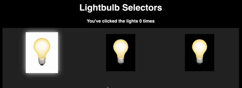

# Lightbulb Selectors

**GOAL**: Today we are going to add event listeners to our web pages in order to create an app that:
- Turns a light on and off when clicked.
- Tracks how many times we have clicked the lightbulbs.



## `.classList.toggle("CLASS_NAME")`

When a lightbulb is "on" it has a class of `"active"` which colors it white. When the lightbulb is "off" it does **NOT** have a class `"active"`, so it is colored black. 

```html
<!-- Lightbulb on -->
<div id="lightbulb1" class="item lightbulb active">💡</div>
<!-- Lightbulb off -->
<div id="lightbulb2" class="item lightbulb">💡</div>
```

In order to add or remove a class, we can use the [`.classList.toggle("CLASS_NAME")` method](https://www.w3schools.com/howto/howto_js_toggle_class.asp) 🔍. This command contains two key parts:
- The `.classList` command returns the list of classes currently attached to a DOM element.
- The `.toggle()` method checks if a specified class is currently present. It will then either add or remove this class name based on whether it is present or absent.

Therefore, for a lightbulb, we can toggle `"active"` by doing

```js
myBulb.classList.toggle("active");
```

## Directions
1. Connect your `script.js` file to your `index.html` using a `<script>` tag. Console.log a message to verify that it works!
2. Use `document.querySelector` to select for each of the three lightbulbs. Store each in it's own variable.
3. Use `document.querySelector` to select the `h3 class = "subtitle"`. Store this in a variable.
4. Create a variable called `count` with an initial value of 0. This will track how many times you have clicked the lightbulbs.
5. For each lightbulb, create an `addEventListener` that responds to a `"click"` event.
6. Every time the lightbulb is clicked you should:
    - Increase `count` by 1.
    - Output the new `count` to the `h3 class = "subtitle"` in the form of `You've clicked the lights COUNT times` with `COUNT` replaced by the current `count` value.
    - Toggle the lightbulbs classList of `"active"`. Thus, if the class of `"active"` is currently present, then it should be removed and vice versa.
    ```js
    myBulb.classList.toggle("CLASS_TO_TOGGLE");
    ```

## Done Early? Try These Stretch Problems! 🚀
- Currently it says `"You've clicked the lightbulbs 1 times"` when you click the lightbulb the first time, but that grammar isn't correct. Create a conditional statement that makes this singular when `count` is 1 and plural for all other values of `count`.
- Rewrite this code to make any object active if your mouse has entered the object. Then add functionality for if your mouse exits the object.
- Research how to use `document.querySelectorAll` to select all the lightbulbs rather than writing `document.querySelector()` three times.
- CHALLENGE PUZZLE: Add more bulbs to the page and get one bulb to turn off multiple bulbs. For example, if you click bulb 1 it alters the class of bulbs 1, 2, and 5.